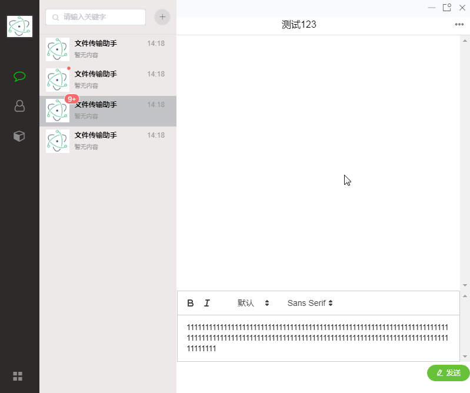
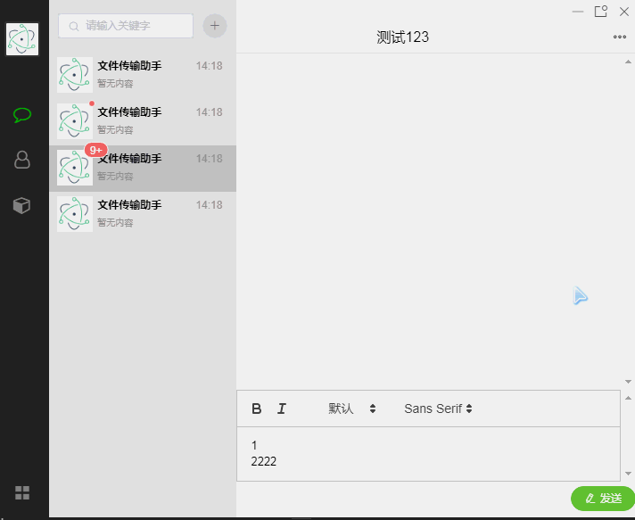

# electron-vue-im

桌面端即时通讯应用，基于 Electron + Vue.js 开发。

<div  align="center">    
    
    
</div>

## 技术栈

| 分类 | 技术 |
|------|------|
| 桌面框架 | Electron |
| 前端框架 | Vue.js |
| 状态管理 | Vuex |
| 路由 | Vue Router |
| 构建工具 | Webpack |
| 打包工具 | electron-builder |

## 项目结构

```
electron-vue-im/
├── .electron-vue/            # 构建配置
│   ├── build.js             # 构建脚本
│   ├── dev-client.js        # 开发客户端
│   ├── dev-runner.js       # 开发运行器
│   ├── webpack.main.config.js   # 主进程配置
│   ├── webpack.renderer.config.js # 渲染进程配置
│   └── webpack.web.config.js   # Web 配置
├── build/                    # 构建资源
│   └── icons/              # 应用图标
├── demo/                    # 演示截图
│   ├── 1.gif
│   └── 1.png
├── dist/                    # 打包输出
│   ├── electron/           # Electron 打包文件
│   └── web/               # Web 打包文件
├── src/                     # 源代码
│   ├── main/              # Electron 主进程
│   │   ├── index.dev.js  # 开发环境入口
│   │   └── index.js     # 主进程入口
│   └── renderer/         # 渲染进程 (Vue)
│       ├── components/   # Vue 组件
│       │   ├── chat/    # 聊天组件
│       │   └── LandingPage/ # 落地页组件
│       ├── pages/       # 页面组件
│       │   ├── Chat.vue # 聊天页面
│       │   └── Index.vue # 首页
│       ├── router/      # 路由配置
│       ├── store/       # Vuex 状态管理
│       ├── App.vue      # 根组件
│       └── main.js      # 渲染进程入口
├── static/                 # 静态资源
├── package.json            # 依赖配置
├── run.bat                # Windows 启动脚本
└── README.md
```

## 组件说明

| 组件 | 说明 |
|------|------|
| `ChatList.vue` | 聊天列表组件 |
| `LeftMenu.vue` | 左侧菜单组件 |
| `ToolBar.vue` | 工具栏组件 |
| `SystemInformation.vue` | 系统信息组件 |

## 页面说明

| 页面 | 说明 |
|------|------|
| `Index.vue` | 首页/聊天列表页 |
| `Chat.vue` | 聊天详情页 |

## 快速开始

### 1. 安装依赖

```bash
npm install
# 或
yarn install
```

### 2. 启动开发服务器

```bash
npm run dev
```

### 3. 构建生产版本

```bash
npm run build
```

### 4. 打包为安装包

```bash
npm run build:dir
```

## npm 脚本

| 命令 | 说明 |
|------|------|
| `npm run dev` | 启动开发服务器 |
| `npm run build` | 构建生产版本并打包 |
| `npm run build:web` | 仅构建 Web 版本 |
| `npm run build:dir` | 构建打包输出目录 |
| `npm run pack` | 打包主进程和渲染进程 |

## 依赖说明

### 生产依赖

| 包 | 说明 |
|----|------|
| electron | 桌面应用框架 |
| vue | 前端框架 |
| vue-router | 路由管理 |
| vuex | 状态管理 |

### 开发依赖

| 包 | 说明 |
|----|------|
| electron-builder | 应用打包工具 |
| webpack | 模块打包工具 |
| babel | JavaScript 编译器 |

## 环境要求

- Node.js >= 8.0
- npm >= 5.6 或 yarn

## 运行平台

- Windows
- macOS
- Linux
